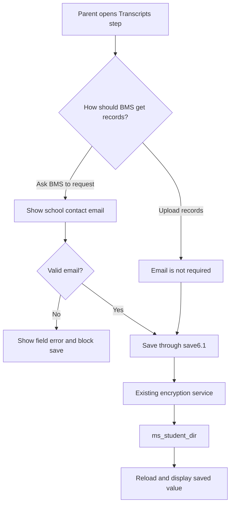

# Registration transcript contact email - Plan

## Goal Capsule

- Objective: Families who ask BMS to request prior-school records can provide a valid school contact email before submitting registration, and staff can read it back in the existing admin registration editor.
- Means: Add the existing Backendless field `student_last_school_contact_email` to the Transcripts step and extend the current `save6.1`, server-save, and validation patterns.
- Authority: The confirmed product rule in this plan governs behavior. The current repo patterns govern implementation. The target Backendless schema must be verified before code writes or production testing.
- Stop conditions: Stop if the target `ms_student_dir` field is missing, has a different name or type, or the existing encryption service does not preserve it. Do not change the unrelated Terms-of-Service worktree edits.
- Execution profile: Code change only. No Backendless deployment, Vercel deployment, or production registration test is included in this plan.
- Tail ownership: The implementer owns repo verification and synthetic browser evidence. Any production schema correction, deployment, or live-family test needs separate approval.
- Scope note: This feature captures the contact and makes it available through the existing admin registration editor. It does not redesign the transcript team's onboarding checklist or create a new transcript-contact queue.

## Product Contract

### Summary

Add one school-contact email field to the BMS registration flow. Show and require it only when a parent chooses to have BMS request records from the prior school.

Families who upload their own records do not need to enter a school email address.

### Problem Frame

The registration form already collects a prior-school contact person and phone number, but it does not collect an email address. The transcript team needs a direct way to contact a prior school without adding work for families who already have the records.

### Key decision

- KD1. Require the school email only for the BMS-request path (session-settled: user-approved — chosen over requiring it for every family because upload families do not need BMS to contact the school) Governs R2 and R3.

### Requirements

#### Registration behavior

- R1. Add the existing `ms_student_dir.student_last_school_contact_email` value to the Transcripts step using the current registration form patterns.
- R2. When the parent chooses “Ask BMS to request records from the school,” show the school-contact email field and require a valid email address before the section can be saved.
- R3. When the parent chooses to upload records themselves, do not show an email validation error and do not require the school-contact email for final submission.
- R4. Preserve any previously entered school email when the parent switches between transcript choices unless the user deliberately edits it.

#### Data and compatibility

- R5. Save the email in `ms_student_dir.student_last_school_contact_email` through the existing student save and encryption path.
- R6. Keep the Backendless property nullable and without a default so older registrations and upload families continue to load.
- R7. Keep the existing prior-school contact person and phone fields unchanged. Keep the new email beside the transcript delivery choice because it is needed only for the BMS-request path. Label it “Prior school records email” and explain that the parent should enter the registrar or records-office address.
- R8. Do not expose the email in logs, URLs, browser test fixtures that are not needed for the scenario, or public links.

#### Admin and testing

- R9. Admin registration editing must load, display, validate, and save the same field through the existing Transcripts section.
- R10. Unit and browser tests must cover both transcript choices, invalid email input, saved-field readback, and older records with no email value.
- R11. The parent save endpoint must apply the same request-only email rule before persisting a `save6.1` payload; browser validation alone is not the data boundary.

### Acceptance examples

- AE1. A parent selects “Ask BMS to request records from the school,” leaves the email blank, and cannot save the Transcripts section. The form identifies the email as required.
- AE2. A parent selects the school-request option and enters `records@example.org`. The section saves, and a fresh reload shows the same value.
- AE3. A parent enters `not-an-email` for the school-request option. The section remains invalid and shows a field-level email error.
- AE4. A parent selects “I’ll upload records myself.” The email field is not required, and final-submit validation passes without an email when all other requirements are complete.
- AE5. An older registration has no `student_last_school_contact_email`. It still loads. The parent can use the upload path without being blocked.
- AE6. An admin opens a synthetic registration, sees the field when the school-request option is selected, edits it, and receives the existing save and audit readback.
- AE7. A request-path record with `not-an-email` cannot pass final submission or a direct parent save request. Switching to upload suppresses the request-only email error; switching back preserves and revalidates the value.

### Scope boundaries

In scope:

- One nullable email property on `ms_student_dir`.
- The parent Transcripts step, section validation, final-submit validation, save allowlist, and synthetic admin or parent browser coverage.
- Clear label, help text, and normal email input behavior for the new records-email field.

### Deferred to follow-up work

- Requiring the existing contact person or phone fields for the school-request path.
- Adding a transcript portal URL, school district identifier, or free-text request instructions.
- Adding a separate transcript-contact table or changing the existing Backendless encryption service.
- Adding an automated onboarding handoff checklist outside the registration app.

### High-level technical design

## Planning Contract

### Key Technical Decisions

- KTD1. Store the value on `ms_student_dir` under `student_last_school_contact_email` as a nullable `String`, rather than creating a new table or changing the Vercel project configuration. This matches the existing registration answer storage and keeps the change inside the current encrypted student-record path.
- KTD2. Keep the field in the Transcripts section and the `save6.1` allowlist. The request choice and the email requirement then share one user flow and one save boundary.
- KTD3. Use the existing `isValidEmail` helper and step-validation error pattern. Do not create a second email parser or silently accept malformed addresses.
- KTD4. Preserve the email when the parent changes transcript choices. The upload path does not need the value, but clearing it would discard useful information and make switching back harder.
- KTD5. Treat the Backendless field as a prerequisite to verify, not as a schema migration performed by the repo change. The target is the BMS registration Backendless application identified by the app ID and environment in `BACKENDLESS_REST_URL`; record only that non-secret identifier. The user has created the field; implementation must confirm its exact property name, type, nullability, and behavior there before writing code that depends on it.
- KTD6. Trim leading and trailing whitespace before persistence, while using the existing `isValidEmail` predicate for the request-only validity check. This keeps pasted addresses usable without storing accidental spaces.

### Assumptions

- `student_last_school_contact_email` exists on the target `ms_student_dir` table with a string-compatible type.
- `BG_13_HR.EncryptDecryptMSStudentDir` encrypts and decrypts the new property using its existing generic student-row behavior. If it uses an undiscovered field allowlist, implementation must stop and document that dependency before changing Cloud Code.
- The existing parent and admin DTOs preserve unknown registration answer fields, so no new public response shape is needed.
- Parent and admin pages share `src/app/reg/sis/_components/step-form.tsx` and the registration field components. Their API routes differ: parent saves use `src/app/api/students/save/route.ts`, while admin saves already validate through `src/app/api/admin/save/route.ts`.
- The current dirty Terms-of-Service edits are unrelated and remain outside the implementation diff.

### System-wide impact

- Backendless: adds one nullable property to the existing student registration record.
- Parent registration: adds conditional display and validation to the Transcripts step.
- Admin registration: inherits the field through the shared wizard and save allowlist.
- Privacy: the email is school-contact information stored with private registration data. Existing server-only Backendless access and logging boundaries remain in force.
- Compatibility: older rows without the property remain valid. The upload path does not depend on the new value.

### Sequencing

1. Verify the target Backendless property and current encrypted read/write behavior, recording the non-secret app/environment identifier derived from the configured Backendless endpoint.
2. Add the field to the shared transcript UI and `save6.1` allowlist.
3. Add conditional step and final-submit validation.
4. Add unit, save-contract, and synthetic browser coverage.
5. Run the repository verification contract and review the final diff for unrelated Terms-of-Service changes.

## Implementation Units

### U1. Add the conditional transcript email field

- **Goal:** Let parents enter the prior school's records email only when BMS is requesting the records.
- **Requirements:** R1, R2, R3, R4, R7.
- **Dependencies:** Backendless field verification and KTD1 through KTD6.
- **Files:**
  - `src/app/reg/_components/transcript-fields.tsx`
  - `src/modules/wizard/transcript-fields.ts`
  - `src/modules/wizard/save-handlers.ts`
  - `tests/modules/wizard/transcript-fields.test.ts`
  - `tests/modules/wizard/save-service.test.ts`
- **Approach:**
  - Add a school-contact email input to the existing Transcripts section and render it only for the school-request choice.
  - Use a normal email input with the label “Prior school records email.”
  - Keep the value in the shared form state when the parent changes choices.
  - Add `student_last_school_contact_email` to the `save6.1` whitelist so parent and admin saves can persist it.
  - Keep the existing prior-school contact person and phone fields unchanged. Add helper text that tells the parent to enter the prior school's registrar or records-office email address.
- **Patterns to follow:** Reuse `TranscriptFields`, `FormTextInput`, `TRANSCRIPT_DELIVERY_SCHOOL`, `readTranscriptDeliveryChoice`, and the existing save allowlist pattern.
- **Test scenarios:**
  - The school-request choice renders the email input with the saved value.
  - The upload choice does not render the email input as a required field.
  - Switching from request to upload and back preserves the entered email in form state.
  - An invalid request-path email error is suppressed while upload is selected and returns when the parent switches back to request.
  - `pickSaveStepFields("save6.1", ...)` keeps the new field and drops unrelated fields.
  - A row without the new field loads without an undefined-value rendering failure.
- **Verification:** The field appears in the correct section, uses the current form styling and accessibility behavior, and is included in a `save6.1` payload without changing unrelated fields.

### U2. Enforce the request-only email rule

- **Goal:** Prevent an incomplete school-request registration while leaving upload families unblocked.
- **Requirements:** R2, R3, R8, R10, R11.
- **Dependencies:** U1.
- **Files:**
  - `src/modules/wizard/step-validation.ts`
  - `src/modules/wizard/submit-validation.ts`
  - `src/app/api/students/save/route.ts`
  - `src/lib/field-validation.ts` only if the existing email helper cannot be reused
  - `tests/modules/wizard/step-validation.test.ts`
  - `tests/modules/wizard/submit-validation.test.ts`
  - `tests/app/api/students/save/route.test.ts`
- **Approach:**
  - In Transcripts-step validation, require a nonblank valid email only when `readTranscriptDeliveryChoice(values.uploadTranscript)` returns the school-request option.
  - Return a field-level error for blank or malformed values, using the existing email validation wording pattern.
  - Add a final-submit requirement tied to the same request choice so a stale or older record cannot bypass the rule. The requirement is missing when the email is blank or fails `isValidEmail`, not only when it is blank.
  - In the parent save route, validate the merged current row and submitted `save6.1` fields before calling `saveStudentStep`, preserving the existing partial-save behavior.
  - Trim the email at the save boundary before it reaches encryption and persistence.
  - Leave the upload path unchanged, including existing transcript-file requirements.
- **Patterns to follow:** Reuse `isValidEmail`, `hasText`, `hasTranscriptDeliveryChoice`, `isFamilyTranscriptDelivery`, and the existing `SubmitRequirement` structure.
- **Test scenarios:**
  - Request choice plus blank email produces a missing-field error on `student_last_school_contact_email`.
  - Request choice plus malformed email produces an invalid-email error.
  - Request choice plus a valid email passes the Transcripts-step validation.
  - Upload choice plus blank email passes the new email rule when transcript files are present.
  - Final-submit validation blocks a request record with no email and accepts a request record with a valid email.
  - Final-submit validation blocks a request record with `not-an-email`.
  - A direct authenticated parent save request with a blank or malformed request-path email is rejected before persistence; a valid trimmed email is accepted.
  - A legacy request record without the new property is blocked with the new missing-field label rather than crashing.
- **Verification:** Step navigation and final submission enforce the same condition, with no email requirement leaking into the upload path.

### U3. Prove persistence and admin compatibility

- **Goal:** Show that the new field survives parent and admin saves through the existing Backendless-shaped test boundary.
- **Requirements:** R5, R6, R9, R10.
- **Dependencies:** U1 and U2.
- **Files:**
  - `tests/fixtures/admin-backend.ts`
  - `tests/browser/admin-flow.spec.ts`
  - `tests/browser/wizard-flow.spec.ts` if the parent fixture needs a focused request-path scenario
  - `tests/modules/admin/admin-integration.test.ts` if the shared admin save/readback contract needs a regression case
  - `src/modules/students/types.ts` only if implementation adds an explicit typed property rather than using the current record index signature
- **Approach:**
  - Add synthetic records for both an upload family without the field and a request family with a valid school email.
  - Exercise the parent request path with a synthetic session: choose the request option, enter the email, save, reload, and read back the fixture state.
  - Exercise the admin path using the existing admin test harness and confirm the field can be edited and saved with the existing audit/readback behavior.
  - Add admin validation cases for blank and malformed request-path email values, plus an upload-path case showing that a missing email does not block save.
  - Keep all fixtures synthetic and avoid real family emails or records.
- **Patterns to follow:** Reuse the current synthetic Backendless server, parent session fixture, admin session fixture, section navigation, and save-response assertions.
- **Test scenarios:**
  - Parent request path saves and reloads `records@example.org`.
  - Parent upload path remains usable when the fixture has no school email.
  - Admin sees the saved request email and can update it through the existing editor.
  - A fresh synthetic readback contains the email and preserves the transcript choice and unrelated answers.
  - The browser request and visible UI contain no production credentials or real student data.
  - The email appears only in the focused synthetic request fixture and intended private form payload; it is absent from URLs, public links, error details, and audit values.
- **Verification:** Synthetic parent and admin browser tests prove display, validation, persistence, and readback across the UI, API, and fixture layers.

## Verification Contract

### Pre-implementation contract checks

- Identify the configured Backendless app/environment without copying REST or Cloud Code secrets into the plan or test output.
- Confirm that target has `ms_student_dir.student_last_school_contact_email` as a nullable string-compatible property.
- In an approved non-production or controlled verification window, record a save/encrypt/read/decrypt round-trip proving that the stored value is ciphertext at rest and is recovered only through `BG_13_HR.EncryptDecryptMSStudentDir`. Synthetic fixtures prove application behavior, not production encryption.
- Confirm the current save path sends the field through `BG_13_HR.EncryptDecryptMSStudentDir` and does not drop it.
- Confirm audit records and error responses contain field names or safe summaries, not the email value.
- Stop before production writes if any of these checks fail or if the property name differs.

### Repository checks

- `npm run typecheck`
- `npm run lint`
- `npm run test`
- `npm run build`
- `npm run knip`
- `npm run test:browser`
- `npm run test:browser:admin`

The focused proof must include the transcript-field, step-validation, submit-validation, save-service, parent-browser, and admin-browser scenarios described in U1 through U3.

## Definition of Done

- The nullable Backendless property is verified with the exact name `student_last_school_contact_email`.
- The Transcripts step shows the email field only for the BMS-request choice.
- A valid email is required for the BMS-request choice and is not required for the upload choice.
- Parent and admin saves use the existing `save6.1` and encryption path, with the parent API enforcing the same request-only rule as the browser.
- Older records without the field still load and upload families can submit without it.
- Unit, direct parent-save, and synthetic browser tests prove validation, save allowlisting, persistence, reload, admin readback, and request-only error transitions.
- Approved Backendless evidence proves the target schema and encrypt/decrypt round-trip; repository fixtures are not treated as proof of encryption at rest.
- Full repository verification passes.
- The final diff contains no changes to the unrelated Terms-of-Service edits or `.impeccable/` files.
- No abandoned experimental code, duplicate field, new table, or alternate storage path remains.
